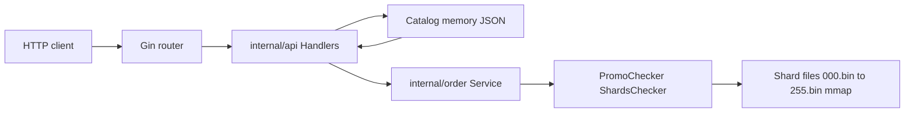

# Service architecture

## Overview

`kart-backend` is a single Go HTTP server (Gin) that exposes product listing and order placement. Product data is loaded from JSON at startup. Promo validation uses **precomputed shard files** on disk (`PROMO_SHARDS_DIR`), not live scanning of gzip at request time.

## Component diagram

## Request path: `POST /order`

1. **Router** (`internal/api`) — JSON decode, auth header `api_key`.
2. **Order service** (`internal/order`) — validate items against catalog; if `couponCode` present, call `Promo.Valid(code)`.
3. **Promo** (`internal/promo.ShardsChecker`) — prelude check, FNV shard, mmap + binary search (see [PROMO_DESIGN.md](PROMO_DESIGN.md)).
4. **Response** — order DTO or error.

## Processes and state

| Component | Mutable at runtime? |
|-----------|----------------------|
| Product catalog | Read-only after load |
| Shard files | Read-only; mmap’d by the kernel |
| Per-shard open state | Lazy init inside `ShardsChecker` |

## Related packages

| Package | Role |
|---------|------|
| `cmd/server` | Entrypoint, env, wiring |
| `internal/api` | HTTP handlers and routing |
| `internal/order` | Business rules for orders + promo hook |
| `internal/promo` | Shard loading, validation, prelude |
| `cmd/preprocessor_seq` | Offline shard builder (not run in the server process) |
