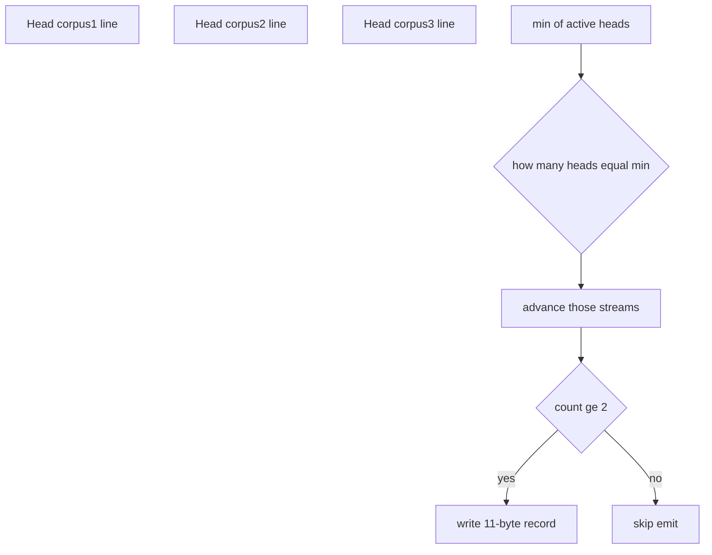
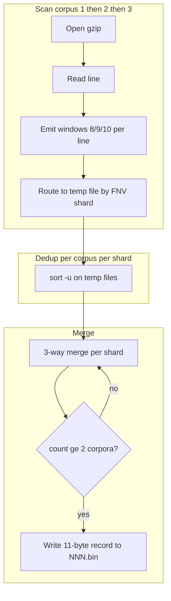
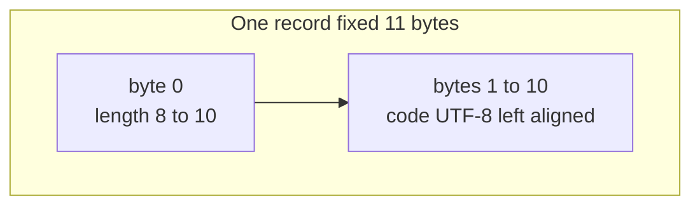
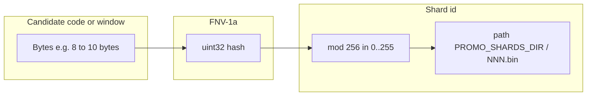
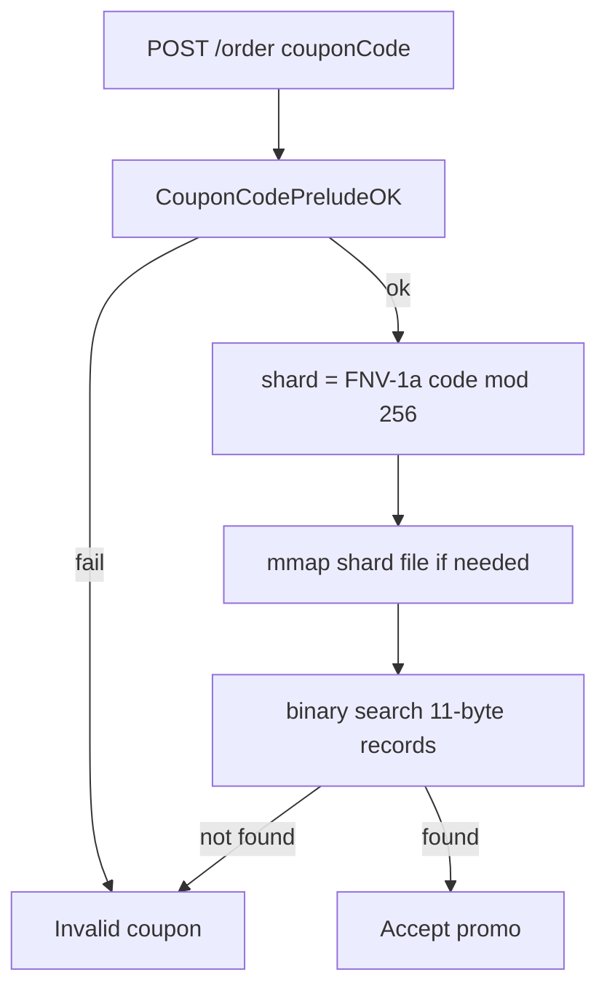
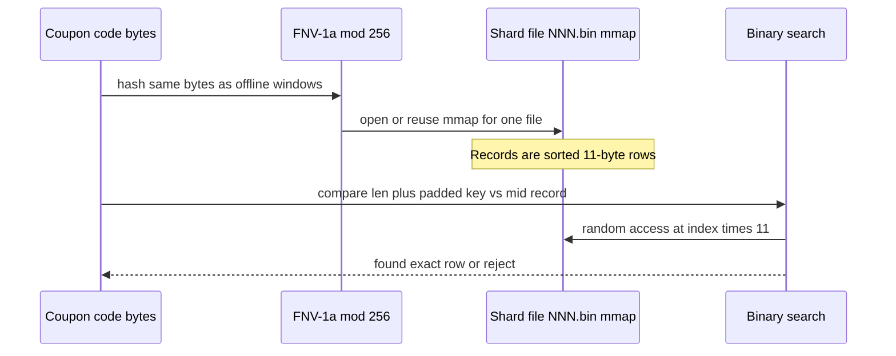
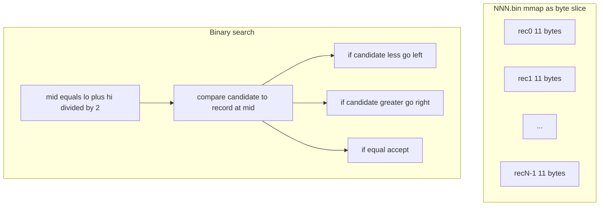

# Promo validation: design and data flow

## Problem statement (challenge rules)

- Three gzipped text corpora: `couponbase1.gz`, `couponbase2.gz`, `couponbase3.gz` under `COUPON_DATA_DIR`.
- Each file is read as **newline-separated lines**. Substrings do **not** cross line boundaries.
- A candidate **coupon code** has UTF-8 length **8, 9, or 10** (ASCII in practice; byte length = rune length).
- The code must appear as a **substring** of at least one line in **at least two** of the three corpora.

**Implementation note:** Validation is done on **bytes** (same as sliding windows on raw line bytes). The prelude check `CouponCodePreludeOK` rejects codes that are not acceptable UTF-8 / length at request time.

## High-level split: offline vs runtime

| Phase | Responsibility |
|-------|----------------|
| **Offline** (`cmd/preprocessor_seq`) | Scan corpora, enumerate windows, deduplicate, merge across corpora, emit only strings that appear in ≥2 corpora, partitioned into 256 shard files. |
| **Runtime** (`internal/promo` `ShardsChecker`) | Map candidate code → shard id (FNV-1a % 256), mmap shard once, **binary search** sorted fixed-width records. |

This keeps **server heap** small and startup time predictable compared to building a giant in-memory map from gzip at boot.

## Offline pipeline (`preprocessor_seq`)

### Step A — Sequential scan per corpus

For `corpusID` in 1..3 (sequential):

1. Open `couponbase{corpusID}.gz` with `gzip.NewReader`.
2. For each non-empty line, trim trailing `\r`.
3. For each window length `w` in `{8,9,10}` and each start index `i` with `i+w ≤ len(line)`:
   - Let `window = line[i:i+w]`.
   - Compute `shard = FNV-1a(window) mod 256` (byte-based hash; see `internal/promo/fnv_shard.go`).
   - Append `window` as a line to a temp text file for that corpus and shard (e.g. under `-tmp`).

**Why sequential corpora:** avoids holding three full working sets in memory at once; temp disk absorbs volume.

### Step B — Deduplicate per corpus, per shard

After Step A, each corpus has its own working directory under `-tmp` (e.g. `corpus1/`, `corpus2/`, `corpus3/`). Inside each, there are **256 text files**—one per FNV shard—named like `shard000.txt` … `shard255.txt`. Each line is **one window string** (raw bytes written as a line; length is 8, 9, or 10 characters). The same window can appear **many times** (many lines in the corpus that contain it, or repeated writes from overlapping windows on the same line). Step B collapses that to **unique strings per (corpus, shard)**, in **sorted order**, without loading everything into RAM.

#### What runs (conceptually)

For **each corpus** in 1…3, and for **each shard** in 0…255 (sequential loop in the implementation):

| Role | Path pattern (under `tmp/corpus{N}/`) |
|------|----------------------------------------|
| **Input** | `shardNNN.txt` — unsorted lines, duplicates allowed |
| **Output** | `shardNNN.uniq` — sorted, **unique** lines only |

The command shape is:

```text
LC_ALL=C sort [-S <memory hint>] -u -o shardNNN.uniq shardNNN.txt
```

- **`sort`** (external program): can use **disk-backed** merges when data does not fit in RAM, which is why this step scales beyond what an in-memory `map` could comfortably hold during the build.
- **`-u` (unique):** after sorting, **only one copy** of each line is kept (equivalent to sort then `uniq` on sorted input). Duplicates are adjacent after sorting, so `-u` drops them in one pass.
- **`-o shardNNN.uniq shardNNN.txt`:** read from the `.txt`, write the result to `.uniq` (atomic replace from the tool’s perspective once the command succeeds).

#### Why `LC_ALL=C`

Locale affects “alphabetical” order. Setting **`LC_ALL=C`** selects the **C / POSIX** locale so `sort` compares lines **by raw bytes** (same as `memcmp` / Go’s `bytes.Compare` on the line bytes). That matches:

- how the **merge step** compares strings in Step C, and  
- how **binary search** orders records at runtime.

If `sort` used a locale-sensitive collation, the **order** of lines could disagree with the merge and with the final `*.bin` sort order, breaking correctness.

#### Empty shards

If `shardNNN.txt` is **missing** or **zero bytes** (no window landed in that shard for this corpus), the implementation may create an **empty** `shardNNN.uniq` and skip `sort`. The merge step must still open all three `.uniq` files for each shard—empty streams are valid.

#### Optional `sortMemMB`

The preprocessor flags `-sortMemMB` is passed through as a **best-effort** hint to `sort` (e.g. `-S 512M` on typical BSD/macOS `sort`). It does not change **correctness**; it only nudges how aggressively `sort` uses memory vs temp files. GNU vs BSD `sort` differ slightly; the code keeps this optional.

#### After a successful sort

The raw **`shardNNN.txt`** can be **deleted** to reclaim disk (only the `.uniq` file is needed for Step C).

#### Why dedupe *before* the three-way merge

The merge needs to know, for each string `s`, whether corpus 1, 2, and/or 3 contain `s`. If corpus 1’s stream still had the same `s` repeated 10,000 times, the merge would need extra logic to skip duplicates. **Per-corpus dedup** turns each corpus+shard stream into a **sorted unique list**, so the merge only ever sees **each string at most once per corpus**—exactly what “does this corpus contain this substring?” means.

#### Progress logging

While deduping, the tool logs periodically (e.g. every 16 shards or every ~30s) so long runs on large corpora show progress.

### Step C — Three-way merge into final shards

Step C is where the challenge rule **“appears in at least two of the three corpora”** is enforced globally, **within one FNV shard at a time**. Inputs are already **sorted** and **deduplicated per corpus** (Step B), so each corpus contributes **at most one line per distinct string** per shard.

#### Inputs and output

For a fixed shard index `shard` in `0..255`:

| Stream | Path under `-tmp` | Contents |
|--------|---------------------|----------|
| Corpus 1 | `corpus1/shardNNN.uniq` | Sorted unique window lines for shard `NNN` |
| Corpus 2 | `corpus2/shardNNN.uniq` | Same |
| Corpus 3 | `corpus3/shardNNN.uniq` | Same |

**Output:** `-out/NNN.bin` where `NNN` is `shard` zero-padded to three digits (e.g. shard `7` → `007.bin`).

If a `.uniq` file is **missing** (e.g. nothing was ever written for that corpus+shard), it is treated as an **empty stream**—the merge still runs with one or two active inputs.

#### Why this is a 3-way merge

You have **three sorted lists** (A, B, C). The **global** sorted order of all distinct strings that appear in any list is obtained by repeatedly taking the **lexicographically smallest** “current line” among the non-exhausted streams—same idea as merging sorted runs in merge sort, but with **three** pointers instead of two.

Because Step B used **`LC_ALL=C`** `sort`, line order is **byte lexicographic**, which matches the comparison used in the merge implementation (string compare on UTF-8 bytes; for ASCII coupons this is the intuitive order).

#### Merge loop (detailed)

Initialize **three read heads** (one per corpus): each head points at the **first** line of that corpus’s `.uniq` file, or is **inactive** if that file is empty/missing.

Repeat until **all three** heads are inactive:

1. **Find `minCode`:** among all active heads, take the **smallest** current line (byte string comparison). If no active head remains, stop.
2. **Count corpora:** `count` = number of active heads whose **current** line **equals** `minCode` (exact string equality—same bytes).
3. **Advance:** for every corpus that had `minCode` at its head, **read the next line** on that stream (advance the head). Corpora that were not equal to `minCode` keep pointing at their current line.
4. **Emit or drop:**
   - If **`count >= 2`**, the string `minCode` is a **valid** promo substring under the challenge rule for this shard’s slice of the keyspace. Append **one** **11-byte record** to `NNN.bin` (length byte + left-padded code; see the **Shard file format** section below).
   - If **`count` is 0 or 1**, do **not** emit (the string appears in **zero or one** corpus only).

Then go back to step 1 with the updated heads.

**Invariant:** After Step B, a given string can appear **at most once** per corpus in that shard file. So `count` is always **0, 1, 2, or 3**—never “5 appearances in corpus 1.” That is exactly “how many of the three corpora contain this substring (for this shard).”

#### Why emitted records are globally sorted in `NNN.bin`

Each iteration handles the **smallest** string still present at any head. That is **precisely** the next string in the **union** of the three sorted lists, in sorted order. Records are written **in that order**, so the final `NNN.bin` is sorted **by the same key** the runtime binary search uses. No second sort pass.

#### Why this enables binary search at runtime

The server memory-maps `NNN.bin` and treats it as an array of `fileSize / 11` fixed-width records. **Binary search** requires a **sorted** array with a **total order** consistent with the compare function. The merge produced that order; the runtime compares `(len, padded bytes)` accordingly.

#### Visual — one iteration of the merge



### Flowchart — offline build



## Shard file format (`000.bin` … `255.bin`)

Each **record** is exactly **11 bytes**:

| Offset | Size | Meaning |
|--------|------|---------|
| 0 | 1 | `len`, must be 8, 9, or 10 |
| 1 | 10 | Code bytes, left-aligned; remaining bytes zero |

Within a file, records are sorted lexicographically by the **10-byte padded key** (same as sorting the variable-length code as a prefix).

**Important:** The file does **not** store per-corpus bitmasks. Membership in ≥2 corpora was enforced **during the merge**; the file only stores **eligible** codes.

### Visual — one record on disk (11 bytes)

Each stored code is a **fixed-width** row so the file can be indexed by `(recordIndex * 11)` without scanning text.



**Byte 0:** length of the coupon string (8, 9, or 10). **Bytes 1–10:** the code left-aligned; remaining bytes are zero padding. Example: code `ABCDEFGH` (8 chars) → `08 | ABCDEFGH | 00 00`.

```text
  offset:  0    1 2 3 4 5 6 7 8 9 10
           +----+--+--+--+--+--+--+--+--+--+
           | 08 | A B C D E F G H | 00 00 |
           +----+--+--+--+--+--+--+--+--+--+
```

## FNV-1a and what `FNV-1a(window)` means

**FNV-1a** (Fowler–Noll–Vo, variant **1a**) is a fast **non-cryptographic** hash: it maps an arbitrary byte sequence (here, a **window** — an 8-, 9-, or 10-byte substring) to a **32-bit** integer.

**Steps (conceptually):**

1. Start from a fixed offset constant (the FNV basis).
2. For each byte of `window` in order: XOR that byte into the hash, then multiply by a fixed prime (FNV-1a order).
3. The result is a `uint32` hash value.

**In this codebase, `window` is:**

- **Offline:** every contiguous substring of length 8, 9, or 10 taken from each corpus line.
- **At runtime:** the candidate **coupon code** bytes (same lengths), after prelude checks.

We then compute **`shardIndex = hash % 256`**, which picks exactly one of **`000.bin` … `255.bin`**. The same string always maps to the same shard, so the builder and the server **must** use the **same** FNV-1a implementation (`internal/promo/fnv_shard.go`).

**What FNV does *not* mean:** the hash has **no business semantics** (it does not mean “valid” or “invalid”). It is only **routing**: spread strings across 256 buckets so each file stays smaller and each lookup touches **one** shard.

**Why FNV instead of SHA-256?** We need **deterministic, cheap** bucketing, not collision resistance against attackers. FNV is a standard choice for hash tables and partition keys.

### Visual — from bytes to shard file



Offline, the same diagram applies to every **window** emitted during the scan: each `window` is hashed and appended to the temp file for that shard before sort/merge.

## Runtime lookup (`ShardsChecker`)

1. **`CouponCodePreludeOK(code)`** — fast reject if length or charset rules fail.
2. **`shard = ShardIndexFNV256Bytes([]byte(code))`** — must match offline routing **exactly** (same bytes, same FNV, same `% 256`).
3. **Lazy mmap** of `PROMO_SHARDS_DIR/NNN.bin` on first use for that shard.
4. **Binary search** on fixed 11-byte records: compare the candidate’s `(len, bytes)` to the record at each midpoint (lexicographic order matches the sorted merge order).

### Flowchart — request-time validation



### Visual — end-to-end lookup (encoding + search)



### Visual — binary search on sorted fixed-width records

The mmap’d region is treated as an array: `recordCount = fileSize / 11`. Indices `lo..hi` are **record** indices (not byte offsets). The compare function checks byte 0 (length) then bytes 1..10 against the candidate.



At each step, the “address” of `record[mid]` is **`baseByteOffset + mid * 11`**, which is why fixed-width encoding matters.

## Correctness intuition

- **Substring:** Sliding windows of length 8–10 cover exactly the set of substrings of those lengths for each line.
- **≥2 corpora:** Per-corpus uniqueness + sorted merge counts corpus presence without a global `map[string]uint8` at build time.
- **Runtime:** Lookup is exact membership in the precomputed set; no probabilistic structures.

## Temporary disk usage

The `-tmp` directory can be **large** during the build (intermediate text + sort). The final `*.bin` shards are small relative to temp space. Delete `-tmp` after a successful run if you need to reclaim disk.
